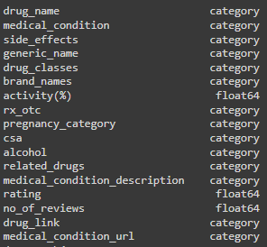
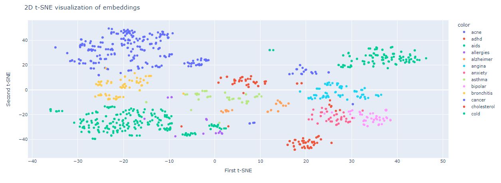
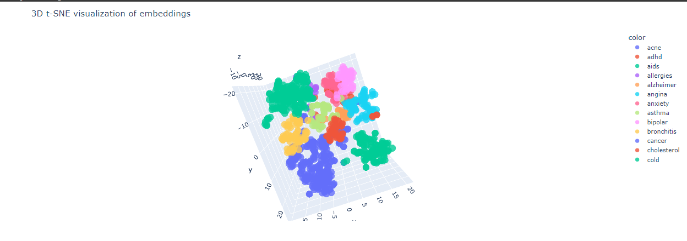
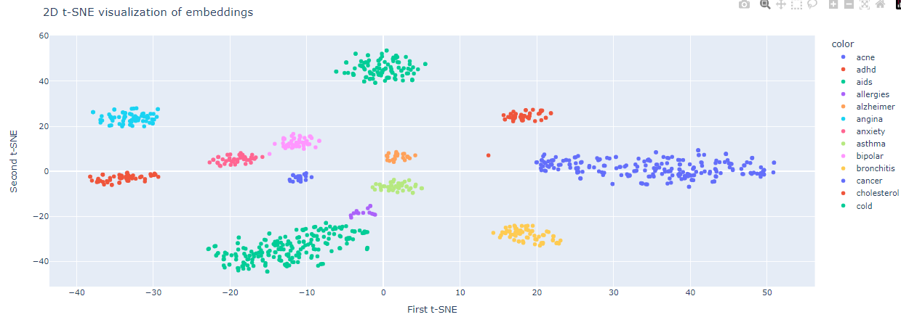
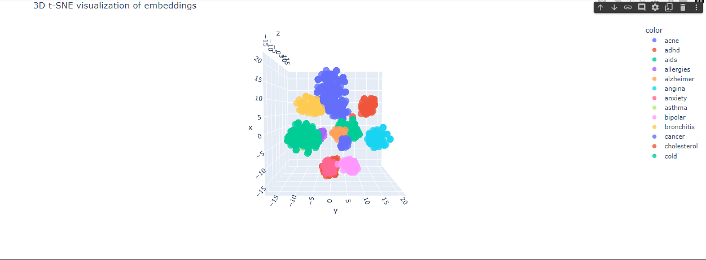

# Medical-Information-Search-Engine

### INTRODUCTION & AIM:
The medical information search engine is an Information Retrival System (I.R.S) built for the purpose of providing healthcare professionals
quick access to comprehensive information about about drugs. This includes side effects, drug classes, activity levels, pregnancy categories, 
etc.

### THE DATASET:
The assumption made is, the dataset entails infromation that has been curated over the couple of years. The feature of these dataset includes
drug name, generic names, drug classes, brand names, activity, medical condition description, related drugs, pregnancy categories, 
Controlled Substances Act (CSA) schedules, alcohol interactions, ratings, drug link, ratings,  number of reviews, alcohol, rx_otc, 
medical condition url, and crucially, the associated side effects of each drug.

[Dataset Link](https://drive.google.com/file/d/1Jx2alhRYKWiS1krOdL_kndMcYEVFwgm2/view?usp=sharing)

### DEVELOPMENT TIMELINE:
 1 WEEK (STRICT DEADLINE)

### DEVELOPMENT PROCESS ENTAIL:
1. Data Proprocessing and Feature Engineering.
2. Information Retrival Development and Testing.
3. Software Development and Productionalization.


### Data Prepocessing and Feature Engineering:
#### Data Prepocessing
This section provides a breakdown of the steps carried out during the data preporocessing stage. 

The dataset consist of a total of 999 rows, and 17 columns to which before preprocessing  2 are numerical based features and the remaining 15 are categorical data.
The first step was to understand the contents of each of the columns in the dataset in order to know how best to represent them and tranform them.
if needed.

From this procedure, I identified the "activity" and the "related drugs" columns needed to be restructured. The related drugs column
contains the name of the other drugs relating to a specific drug, and their urls. Trasnforming this column entained seperating this into two different
features. The actitivity column contained percentages, idealy making it a float value, but because it contain percent sign, it was represented
as a string. After re-representing it in the ideal format. I made sure the dataframe conformed to their respective format.

#### Correct dataype representation.


The next important process was to handle the null values, as explained in the notebook health data is very sensitive data and handing null
would require a certain of level medical expertise. Hence, the best approach to handle the null values was to replace them with a tag that 
indicates the value is missing.

#### Feature Engineering:
##### This phase consist of two sections. 
1. Using the embedding layer of a pre-trained model as is.
2. Fine-tuning the emedding layer to the dataset making it domain specific.

##### The Intuition:
The idea behind the system is, professionals can query the the datastore on drugs information, hence the semantic algorithm should be able to 
understand the relationship between the various types of names of drugs that could be used to referrence a specific drug, and also the medical 
condition the drug is used for. An example is, if a user asks about 'isotretinoin', the algorithm should know that 'isotrerinoin' could also 
be referred to as 'Accutane'. The alogrithm should also be able to tell that the drug is used for treating Acne.

###### Phase 1:
To achieve this I combined the "drug_name", "drug_classes", "brand_names", "medical_condition", and "related_drugs" columns together forming a single document,
called "drug_information". When represented in a vector space, you should be able to see that drugs associated with the specific medical conditions will be clustered together. 
These visualizations can be found in the notebooks used in developing the embedding matrix.


###### Phase 2:
Here, the new column "drug_information" and "medical_condition" column are used for fine tuning. Here the "medical_condition" is used as a label. 
The "medical_condition" contains 13 unique values which can be looked at as the categories. The [quaterion](https://github.com/qdrant/quaterion) framework is used to update
embedding layer of a pre-trained model, making the model a lot more domain specific. 

Refer to the notebook for more information. [Link](https://github.com/kene111/Medical-Information-Search-Engine/blob/main/notebooks/IRS-DATA-PREPROCESSING.ipynb).


### Information Retrival Development and Testing:
###### Phase 1:
The ```multi-qa-MiniLM-L6-cos-v1``` pre-trained model was used to encode the drug_information feautre, creating a learned embedding matrix.
The model was trained on 213 million question and answer pairs. After the encoding has been done, it create an embedding equal to the number of 
feature rows present in the dataset. In this project, the size of the embedding is (999, 384). 

After embedding the features, to retrieve information, the query is embedding using the same process, and the projected into the vector space,
the distance between the query vector and sub vector spaces are calculated using cosine similarity, where the n closest results are returned.
 
The visualization of the embbedings is presented below.

#### 2D Represention:


#### 3D Represention:



###### Phase 2:
In this section we re-train the embedding layer of the ```multi-qa-MiniLM-L6-cos-v1``` pre-trained model in order to fine-tune it to dataset.
The embedding representation is presented below:

#### 2D Represention:


#### 3D Represention:



# Evaluation:
After crafting a mini test set for the model, It is observed that the pre-trained model performed better with an accuracy of 75%, while the
fine tuned model achieved an accuracy of 50%, not being able to generalize well. This results also indicates the model overfitted on the data,
to which the best way for improvement is more data.

Due to constraint of the deadline, I went ahead with the pre-trained model without fine-tuning.

More information can be found in the links provided:
Phase 1: [Link](https://github.com/kene111/Medical-Information-Search-Engine/blob/main/notebooks/INFORMATION%20RETRIVAL%20LOGIC%20-%20%20PHASE%201.ipynb).
Phase 2: [Link](https://github.com/kene111/Medical-Information-Search-Engine/blob/main/notebooks/INFORMATION%20RETRIVAL%20LOGIC%20-%20%20PHASE%202.ipynb).


Software Development and Productionalization.

This section contains details on preparing the Information Retrival System for production. Link to The Code is [here](https://github.com/kene111/Medical-Information-Search-Engine/tree/main/IRS).


