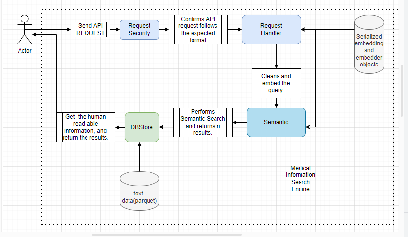
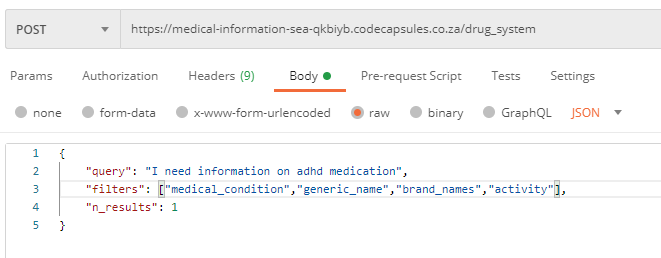
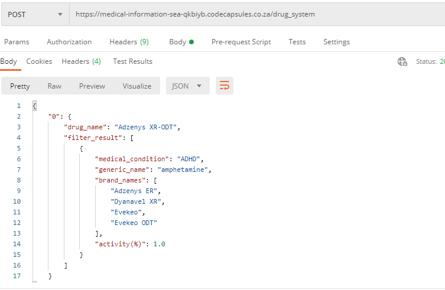

# Medical-Information-Search-Engine

### INTRODUCTION & AIM:
The Medical Information Search Engine is an Information Retrival System (I.R.S) built for the purpose of providing healthcare professionals
quick access to comprehensive information about about drugs. This information includes side effects, drug classes, activity levels, pregnancy categories, etc.

### THE DATASET:
The assumption made is, the dataset entails infromation that has been curated over the couple of years. The features of the dataset are drug names, generic names, drug classes, brand names, activity, medical condition description, related drugs, pregnancy categories, 
Controlled Substances Act (CSA) schedules, ratings, drug link,  number of reviews, alcohol, rx_otc, 
medical condition url, and crucially, the associated side effects of each drug or group of drugs.

[Dataset Link](https://drive.google.com/file/d/1Jx2alhRYKWiS1krOdL_kndMcYEVFwgm2/view?usp=sharing)

### DEVELOPMENT TIMELINE:
 1 WEEK (STRICT DEADLINE)

### DEVELOPMENT PROCESS ENTAIL:
1. Data Preprocessing and Feature Engineering.
2. Information Retrival Development and Testing.
3. Software Development and Productionalization.


### Data Prepocessing and Feature Engineering:
#### Data Prepocessing:
This section provides a breakdown on the steps carried out during the data preporocessing stage. 

The dataset consist of a total of 999 rows, and 17 columns to which before preprocessing,  2 are numerical based features and the remaining 15 are categorical based features.
The first step was to understand the contents of each of the columns in the dataset in order to know how best to represent them and tranform them, if needed.

From this procedure, I identified the ```activity``` and the ```related drugs``` columns needed to be restructured. The related drugs column
contains the name of the other drugs relating to a specific drug, and their respective urls. Trasnforming this column entained seperating this feature into two different features. The actitivity column contained numerical percentages, ideally making it a float value, but because it contained a percentage sign, it was represented as a string. After re-representing it in the ideal format. I made sure the dataframe conformed to the accurate datatype format.

#### Correct dataype representation.


The next important process was to handle the null values, as explained in the notebook health data is very sensitive data and handing null
would require a certain of level medical expertise. Hence, the best approach to handle the null values was to replace them with a tag that 
indicates the value is missing.

#### Feature Engineering:
##### This section consists of two phase. 
1. ```Phase 1```: Preparing the dataset, to create an embedding layer using a pre-trained model as is.
2. ```Phase 2```: Structuing the dataset for the purpose of fine-tuning the emedding layer to the dataset making it domain specific.

##### The Intuition:
The idea behind the system is, professionals can query the datastore on comprehensive information on specific drugs. Hence the emebedding layer should be able to represent the relationship between various types of names of drugs that could be used to referrence a specific drug, and also the medical condition the drug is used for. An example is, if a user asks about 'isotretinoin', with the use of the embedding representation, it can be indicated that 'isotrerinoin' could also be referred to as 'Accutane', and it is used for Acne.

###### Phase 1:
To achieve this I combined the ```drug_name```, ```drug_classes```, ```brand_names```, ```medical_condition```, and ```related_drugs``` columns together forming a single document,
called ```drug_information```. When represented in a vector space, you should be able to see that drugs associated with specific medical conditions will be clustered together. 

###### Phase 2:
Here, the new column ```drug_information``` and ```medical_condition``` column are used for fine tuning. Here the "medical_condition" is used as a label. 
The "medical_condition" column contains 13 unique values which can be looked at as the categories. The [Quaterion](https://github.com/qdrant/quaterion) framework is used to update
embedding layer of the pre-trained model, making the model a lot more domain specific. 

Refer to the notebook for more information. [Link](https://github.com/kene111/Medical-Information-Search-Engine/blob/main/notebooks/IRS_DATA_PREPROCESSING.ipynb).


### Information Retrival Development and Testing:
###### Phase 1:
The ```multi-qa-MiniLM-L6-cos-v1``` pre-trained model is used to encode the ```drug_information``` feautre, creating a learned embedding matrix.
The model was trained on 213 million question and answer pairs. After the encoding was done, it creates an embedding equal to the number of feature rows present in the dataset. In this project, the size of the embedding is (999, 384). 

After embedding the features, to retrieve information, the query is embedding using the same process, and the projected into the vector space, the distance between the query vector and sub vector spaces are calculated using ```cosine similarity```, where the n closest results are returned.

More information on the model can be found [here](https://huggingface.co/sentence-transformers/multi-qa-MiniLM-L6-cos-v1).
 
The visualization of the embbedings is presented below:

#### 2D Represention:


#### 3D Represention:


###### Phase 2:
In this section we re-train the embedding layer of the ```multi-qa-MiniLM-L6-cos-v1``` pre-trained model in order to fine-tune it to dataset.
The embedding representation is presented below:

#### 2D Represention:


#### 3D Represention:


#### Evaluation:
After crafting a mini test set for the model, It is observed that the pre-trained model performed better with an accuracy of 75%, while the
fine tuned model achieved an accuracy of 50%, not being able to generalize well due to the little amount of data used. For better results, the embedding layer needs more data to create a richer embedding space for better vector representation.

Due to constraint of the deadline, I went ahead with the pre-trained model without fine-tuning.

More information can be found in the links provided:
Phase 1: [Link](https://github.com/kene111/Medical-Information-Search-Engine/blob/main/notebooks/INFORMATION%20RETRIVAL%20LOGIC%20-%20%20PHASE%201.ipynb).
Phase 2: [Link](https://github.com/kene111/Medical-Information-Search-Engine/blob/main/notebooks/INFORMATION%20RETRIVAL%20LOGIC%20-%20PHASE%202.ipynb).


### Software Development and Productionalization.

This section contains details on preparing the Information Retrival System for production. Link to The Code is [here](https://github.com/kene111/Medical-Information-Search-Engine/tree/main/IRS).

The Information Retrival System consist of the following sections:
1. ```db```: The db folder contains the cleaned datasets in parquet format and a module used to interact with the compressed files. Parquet format utilizes high level compression algorithms. Pandas now supports parquet format, hence information can be parsed and filtered through using the pandas framework. The ```db/store``` directory consist of three files:
   1. ```db.parquet``` : This file contains the main cleaned dataset.
   2. ```prod_feature_db.parquet```: This file contains the dataframe consisting of the ```drug_name``` feature column and ```drug_information``` column, where ```drug_name``` column acts as a foreign key to db.parquet 
   3. ```related_db.parquet```: This file contains the dataframe consisting of the ```related_drugs``` and the ```related_drugs_url``` columns, where ```related_drugs``` acts as a foreign key to db.parquet
2. ```pre_trained_storage```: This folder contains the pickled file named ```pre-trained_embedder.pkl```, containing learned embeddings and the pre-trained embedding model.
3. ```request_handler```: This folder contains the module the handles pre-processing and making sure the request data is in a format that can be accessed easily through out the system.
4. ```semantic```: This folder contains the module that handles the performing semantic search and return n number of results.
5. ```utils```: This folder contains utility modules and functinos. These include:
    1. ```data_embedder.py```: This module is used to propely clean and embed the query.
    2. ```system_security.py```: This module makes sure the request data is in the correct format with expected keys and datatypes.
    3. ```system_settings.py```: This script contains global system configuration variables.
    4. ```system_utils.py```: This script contains other utility functions.
7.  ```app.py```: This script runs the entire process.
### Process Diagram of the System:


#### HOW TO RUN THE SYSTEM LOCALLY:
1. Create a virtual environment.
2. Change directory to the IRS FOLDER:
  ```cd IRS```
3. Install the dependecies from the requirements.txt file:
   ```pip install -r requirements.txt```
4. Activate the system server by running:
   ```python app.py```
   You can now make requests using ```post man``` to the running server. Request formats are explained below.


#### REQUEST FORMATS
An example of the expected request format is:
```
{
  "query": "I need information on minocycline",
  "filters": ["side_effects","generic_name","brand_names","related_drugs"],
  "n_results": 3
}
```
another example:
```
{
  "query": "What do you have on adhd?",
  "filters": "all",
  "n_results": 6
}
```
##### Request Keys:
1. The ```query``` key contains an enquiry about a specific drug that can be found in the datastore.
2. The ```filters``` key contains a list of the specific columns you want information on, if ```filters``` is set to ```"all"```, it returns all the information on that drug.
3. The ```n_results``` key contains the number of results you want for an enquiry.

##### The expected filters are:
```drug_name```, ```medical_condition```, ```side_effects```, ```generic_name```, ```drug_classes```, ```brand_names```, ```activity```, ```rx_otc```, ```pregnancy_category```, ```csa```, ```alcohol```, ```related_drugs```, ```medical_condition_description```, ```rating```, ```no_of_reviews```, ```drug_link```, and ```medical_condition_url```
###### EDGE CASES HANDLED:
1. When users make enquiries that have no relation to the information on the data store, the system returns:
   ```
   {
    "message": "Information on this query cannot be found in the data store."
    }
   ```
   This works by calculating the mean score of the number of results returned. It is observed that queries that do not relate to the        information in datastore returns low scores. Hence, a treshold value is set, anything lower than the threshold value is not returned.

2. When users make requests with the incorrect keys and wrong datatypes for the values, the system returns:
   ```
   {
    "message": "The request information does not tally with what the system expects, re-check your request data!"
    }
   ```
   
#### API URL: ```https://medical-information-sea-qkbiyb.codecapsules.co.za/drug_system```

#### API REQUEST EXAMPLE


#### API RESULT 

